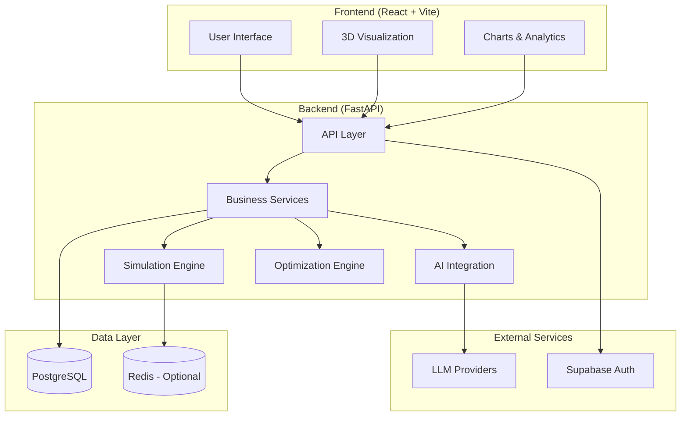
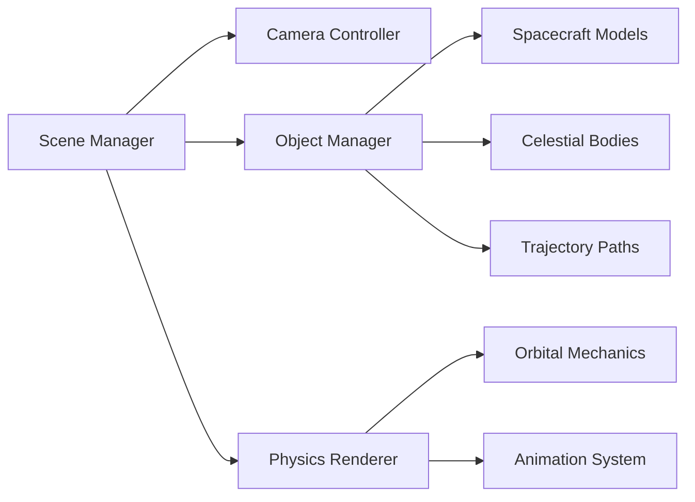

# Design Document

## Overview

AstraForge is architected as a modern full-stack web application with a React frontend and FastAPI backend, designed to provide an intuitive yet powerful space mission simulation experience. The system leverages AI for mission ideation, physics engines for realistic simulation, and interactive 3D graphics for visualization.

The architecture follows a clean separation of concerns with the frontend handling user interaction and visualization, while the backend manages AI integration, physics calculations, data persistence, and optimization algorithms.

## Architecture

### High-Level Architecture



### Technology Stack

**Frontend:**
- React 18 with Vite for fast development and building
- React Query for server state management and caching
- React Router for client-side routing
- React-Three-Fiber + drei for 3D visualization
- Recharts for 2D data visualization
- Zod for client-side schema validation
- Tailwind CSS for styling

**Backend:**
- FastAPI with Python 3.11+ for high-performance API
- Pydantic v2 for data validation and serialization
- SQLAlchemy + Alembic for database ORM and migrations
- httpx for external API calls
- numpy/scipy for mathematical computations
- Custom genetic algorithm implementation for optimization

**Infrastructure:**
- PostgreSQL for primary data storage
- Redis for caching and session management (optional for MVP)
- Supabase for authentication and managed database
- Vercel/Netlify for frontend deployment
- Railway/Fly.io for backend deployment

## Components and Interfaces

### Frontend Components

#### Core Pages
- **HomePage**: Mission prompt input with AI-powered generation
- **MissionDetailPage**: Comprehensive mission view with specs, charts, and 3D visualization
- **GalleryPage**: Browse and manage missions with filtering and search

#### Shared Components
- **MissionCard**: Reusable mission preview component
- **Chart Components**: Trajectory plots, performance metrics, timeline visualization
- **3D Scene**: Interactive space environment with spacecraft and celestial bodies
- **AuthWrapper**: Authentication state management

#### 3D Visualization Architecture


### Backend Services

#### API Layer (`/api`)
- **missions.py**: Mission CRUD operations, simulation triggers
- **auth.py**: Authentication endpoints and middleware
- **gallery.py**: Mission browsing and search functionality
- **optimization.py**: Optimization job management

#### Business Services (`/services`)
- **ideation_service.py**: AI-powered mission generation
- **simulation_service.py**: Physics-based mission simulation
- **optimization_service.py**: Genetic algorithm optimization
- **validation_service.py**: Mission parameter validation

#### AI Integration (`/ai`)
- **llm_provider.py**: Abstract base class for LLM providers
- **claude_provider.py**: Anthropic Claude integration
- **openai_provider.py**: OpenAI GPT integration
- **groq_provider.py**: Groq integration
- **prompt_templates.py**: Mission generation prompts

### Data Models

#### Core Domain Models

```python
# Mission specification
class Mission(BaseModel):
    id: UUID
    name: str
    description: str
    objectives: List[str]
    spacecraft_config: SpacecraftConfig
    trajectory: TrajectoryPlan
    timeline: MissionTimeline
    constraints: MissionConstraints
    created_at: datetime
    user_id: Optional[str]

# Spacecraft configuration
class SpacecraftConfig(BaseModel):
    vehicle_type: str
    mass_kg: float
    fuel_capacity_kg: float
    thrust_n: float
    specific_impulse_s: float
    payload_mass_kg: float

# Trajectory planning
class TrajectoryPlan(BaseModel):
    launch_window: DateRange
    departure_body: str
    target_body: str
    transfer_type: str  # hohmann, bi-elliptic, etc.
    maneuvers: List[Maneuver]
    total_delta_v: float

# Simulation results
class SimulationResult(BaseModel):
    mission_id: UUID
    success_probability: float
    total_duration_days: float
    fuel_consumption_kg: float
    cost_estimate_usd: float
    risk_factors: List[RiskFactor]
    performance_metrics: Dict[str, float]
```

#### Database Schema

```sql
-- Core tables
CREATE TABLE missions (
    id UUID PRIMARY KEY,
    name VARCHAR(255) NOT NULL,
    description TEXT,
    specification JSONB NOT NULL,
    user_id VARCHAR(255),
    created_at TIMESTAMP DEFAULT NOW(),
    updated_at TIMESTAMP DEFAULT NOW()
);

CREATE TABLE simulation_results (
    id UUID PRIMARY KEY,
    mission_id UUID REFERENCES missions(id),
    result_data JSONB NOT NULL,
    created_at TIMESTAMP DEFAULT NOW()
);

CREATE TABLE vehicle_presets (
    id UUID PRIMARY KEY,
    name VARCHAR(255) NOT NULL,
    configuration JSONB NOT NULL,
    is_public BOOLEAN DEFAULT true
);

-- Indexes for performance
CREATE INDEX idx_missions_user_id ON missions(user_id);
CREATE INDEX idx_missions_created_at ON missions(created_at);
CREATE INDEX idx_simulation_results_mission_id ON simulation_results(mission_id);
```

## Error Handling

### Frontend Error Handling
- **Network Errors**: Retry logic with exponential backoff
- **Validation Errors**: Real-time form validation with clear error messages
- **3D Rendering Errors**: Graceful fallback to 2D visualization
- **Authentication Errors**: Automatic redirect to login with session recovery

### Backend Error Handling
- **AI Provider Failures**: Automatic failover between providers
- **Simulation Errors**: Detailed error reporting with suggested fixes
- **Database Errors**: Transaction rollback with user-friendly messages
- **Rate Limiting**: Queue management for expensive operations

### Error Response Format
```python
class ErrorResponse(BaseModel):
    error_code: str
    message: str
    details: Optional[Dict[str, Any]]
    suggestions: Optional[List[str]]
    retry_after: Optional[int]
```

## Testing Strategy

### Frontend Testing
- **Unit Tests**: Component testing with React Testing Library
- **Integration Tests**: API integration and user flow testing
- **Visual Tests**: 3D scene rendering and chart accuracy
- **E2E Tests**: Critical user journeys with Playwright

### Backend Testing
- **Unit Tests**: Service layer and utility function testing
- **Integration Tests**: Database operations and external API calls
- **Physics Tests**: Orbital mechanics calculation validation
- **Load Tests**: Simulation performance under concurrent load

### Test Data Strategy
- **Seeded Missions**: Curated example missions for testing and demos
- **Vehicle Presets**: Realistic spacecraft configurations
- **Validation Datasets**: Known mission parameters for accuracy testing

### Continuous Integration
```yaml
# GitHub Actions workflow
- Lint and type checking (frontend: ESLint + TypeScript, backend: ruff + mypy)
- Unit test execution with coverage reporting
- Integration test suite against test database
- Build verification for both frontend and backend
- Automated deployment to staging environment
```

## Performance Considerations

### Frontend Optimization
- **Code Splitting**: Route-based and component-based lazy loading
- **3D Optimization**: Level-of-detail rendering and frustum culling
- **Data Caching**: React Query for server state management
- **Bundle Optimization**: Tree shaking and asset compression

### Backend Optimization
- **Database Indexing**: Optimized queries for mission search and retrieval
- **Caching Strategy**: Redis for simulation results and AI responses
- **Async Processing**: Background tasks for long-running simulations
- **Connection Pooling**: Efficient database connection management

### Scalability Architecture
- **Horizontal Scaling**: Stateless API design for load balancer compatibility
- **Database Sharding**: User-based partitioning for large datasets
- **CDN Integration**: Static asset delivery optimization
- **Monitoring**: Application performance monitoring and alerting

## Security Considerations

### Authentication & Authorization
- **Magic Link Auth**: Secure, passwordless authentication via Supabase
- **Session Management**: JWT tokens with appropriate expiration
- **Rate Limiting**: API endpoint protection against abuse
- **CORS Configuration**: Proper cross-origin request handling

### Data Protection
- **Input Validation**: Comprehensive validation at API boundaries
- **SQL Injection Prevention**: Parameterized queries via SQLAlchemy
- **XSS Protection**: Content Security Policy and input sanitization
- **Sensitive Data**: Environment variable management for API keys